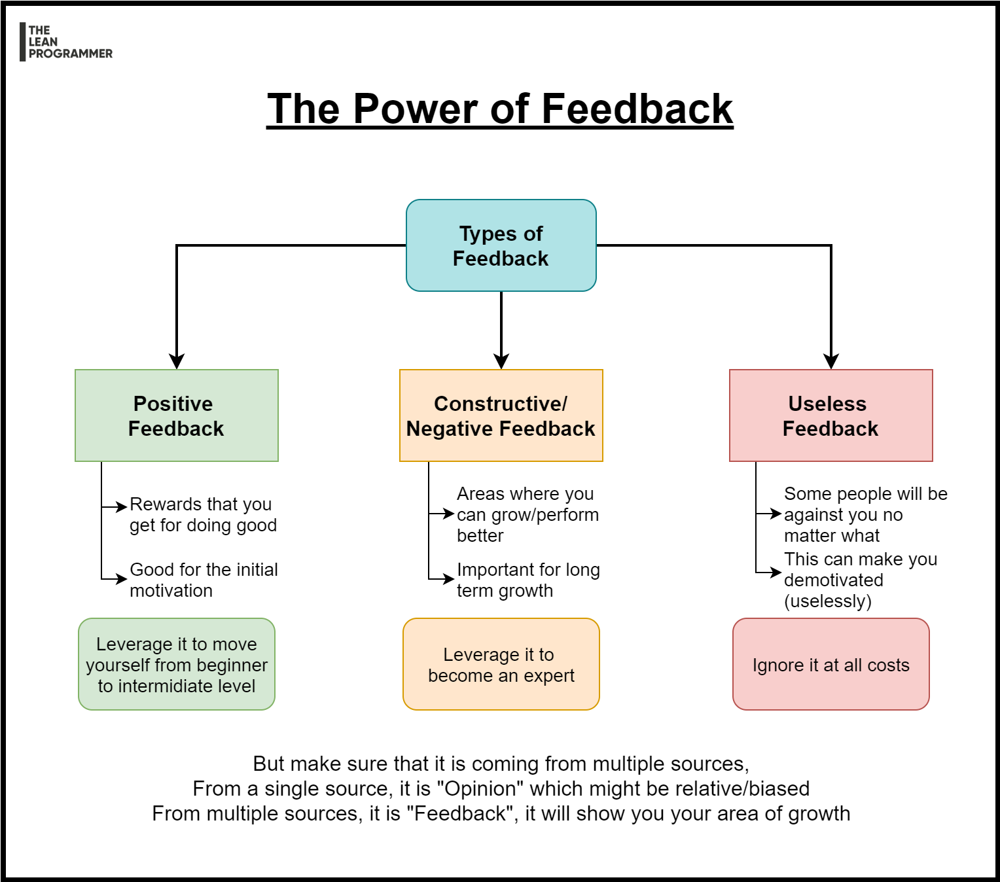

# The Power of Feedback

No matter what's the level of your skills, you can always make use of feedback,

📌 Leverage positive feedback to level up yourself from beginner to intermediate

📌 Leverage negative/constructive feedback to level up yourself from intermediate to expert

📌 Ignore the useless feedback,

And remember, feedback from one source is "Opinion", it can be correct or just a point of view,

True feedback can be known from multiple sources.

***

[See the full post here](https://www.linkedin.com/posts/madhavbahl_no-matter-whats-the-level-of-your-skills-activity-6744463132015554560-qe1d)