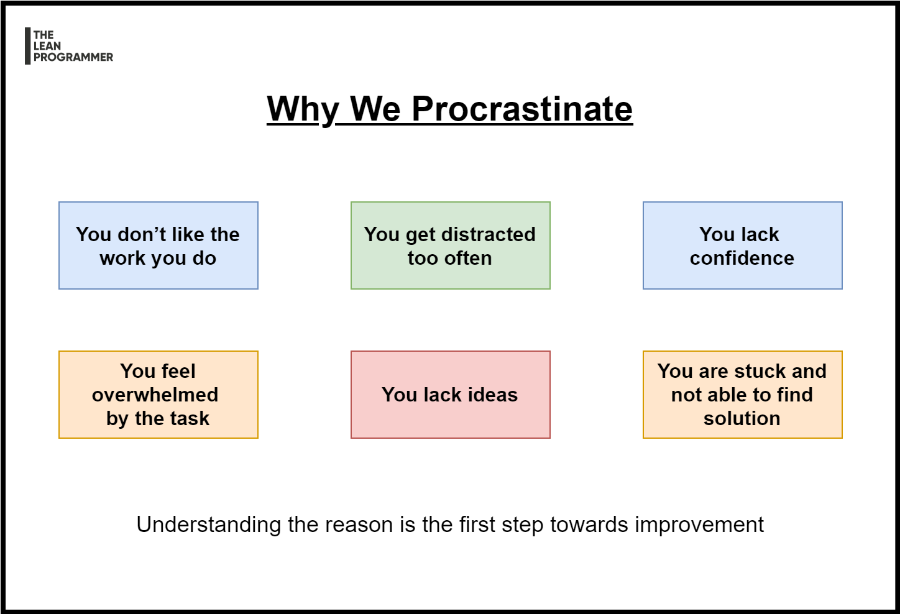

# Why Do We Procrastinate

Understanding and accepting the reason is the first step towards improvement 💥

Some of the reasons why we procrastinate -

📌 Don't like the work?

📌 Get distracted too often?

📌 Lack confidence?

📌 Feel overwhelmed by the task?

📌 Lack Ideas?

📌 Stuck and not able to find a solution?

Be aware about the reason (there might be multiple), and watch your thoughts ✨

Being aware can help you deal with procrastination.

***

[See the full post here](https://www.linkedin.com/posts/madhavbahl_understanding-and-accepting-the-reason-is-activity-6744837669144059904-LWl-)