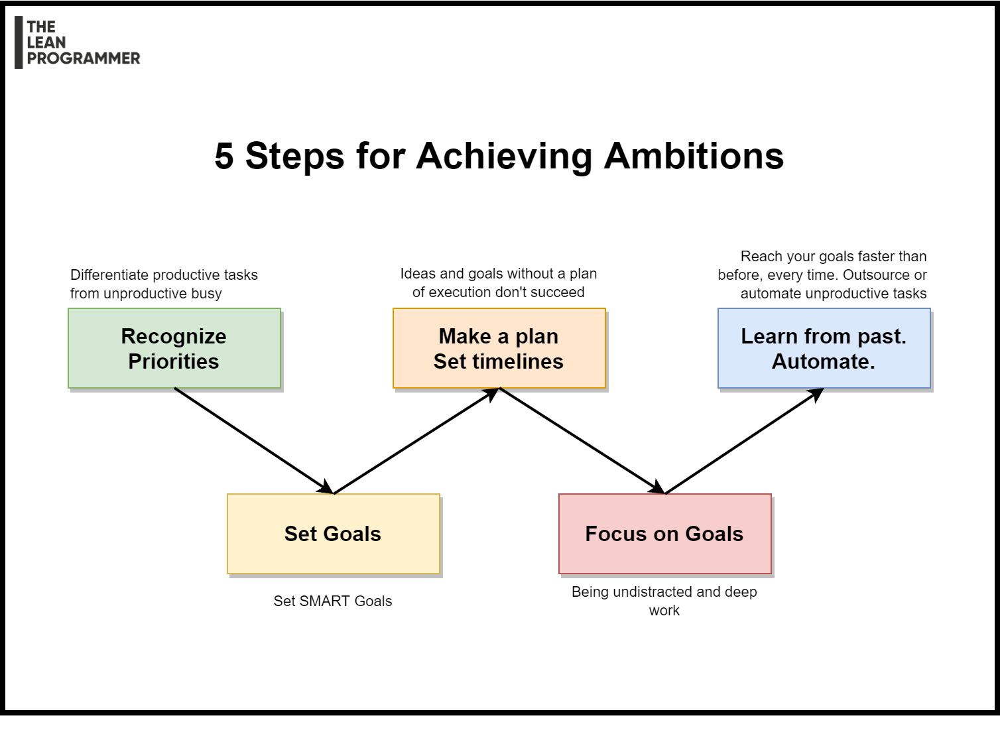

# 5 Steps for Achieving Ambitions

Have big dreams?

These 5 steps will help you -

📌 Recognize Priorities
👉 Not every task contributes towards your ambitions
👉 Identify the 20% of tasks that bring you 80% of the success
👉 Differentiate "productive tasks" from "busy tasks"
👉 Do these high priority tasks first, trying to do everything might make you end up doing nothing

📌 Set SMART Goals
👉 Specific
👉 Measurable
👉 Attainable
👉 Relevant
👉 Time-Bound

📌 Make a plan or a roadmap
👉 Clearly list down how you are going to proceed
👉 Remember, failing to plan is planning to fail

📌 Focus on goals
👉 When you work, keep aside the unproductive distractions
👉 Try doing Deep Work

📌 Learn from the past and automate whatever possible
👉 Not everything requires your time, but we learn it only after exploring
👉 For the next iteration cycle of these steps, identify these tasks, and if possible automate them.
👉 Your aim shouldn't just be reaching your goals, you should aim to reach your goals faster than before.

***

[See the full post here](https://www.linkedin.com/posts/madhavbahl_have-big-dreams-these-5-steps-will-help-activity-6745586839186403328-Hez9)