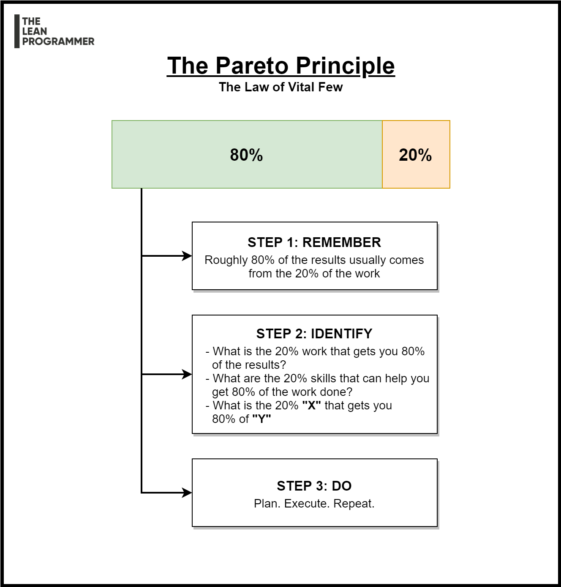

# The Law of Vital Few

3 Simple steps to apply the Pareto principle in your life -

📌 Remember
👉 80% of the results come from almost 20% of work

📌 Identify
👉 that 20%

📌 Do
👉 more of that 20% while growing (gradually) on the other 80%

***

[See the full post here](https://www.linkedin.com/posts/madhavbahl_3-simple-steps-to-apply-the-pareto-principle-activity-6745959980895150080-NBxM)