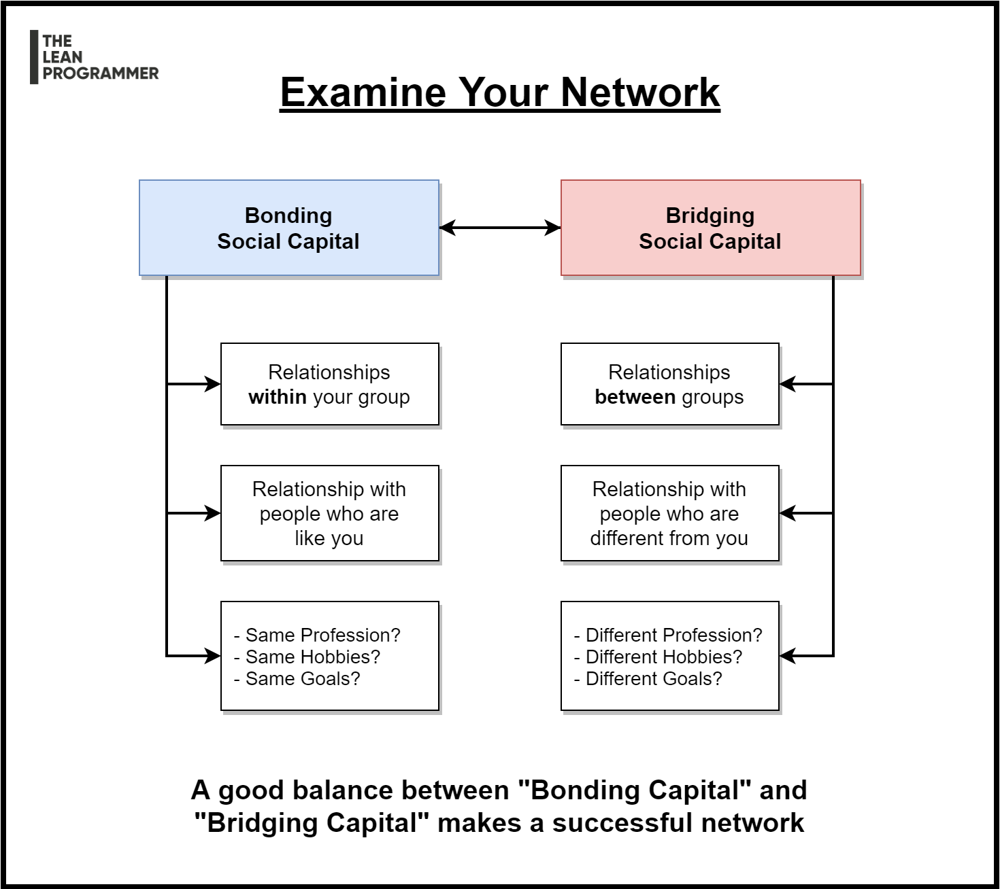

# Bonding Social Capital vs Bridging Social Capital

One mistake that almost all of us make 👇

We often tend to connect with people having same/similar interests, hobbies, goals, passion, or profession.

There are two categories when we talk about social capital

📌 The Bonding Capital
💥 Your relationships "within a group"

📌 The Bridging Capital
💥 Your relationships "between groups"

In short term, it's your bonding capital that might get you more opportunities/learning/growth,

But, in long term, having a good bridging capital is also essential to

💥 Broaden your perspective
💥 Open you to new opportunities
💥 Get a better understanding of the bigger picture

So, have a balance between both.

Remember, a good network is formed by a good balance between bonding social capital and bridging social capital.

***

[See the full post here](https://www.linkedin.com/posts/madhavbahl_one-mistake-that-almost-all-of-us-make-activity-6747845691126673408-XZQM)