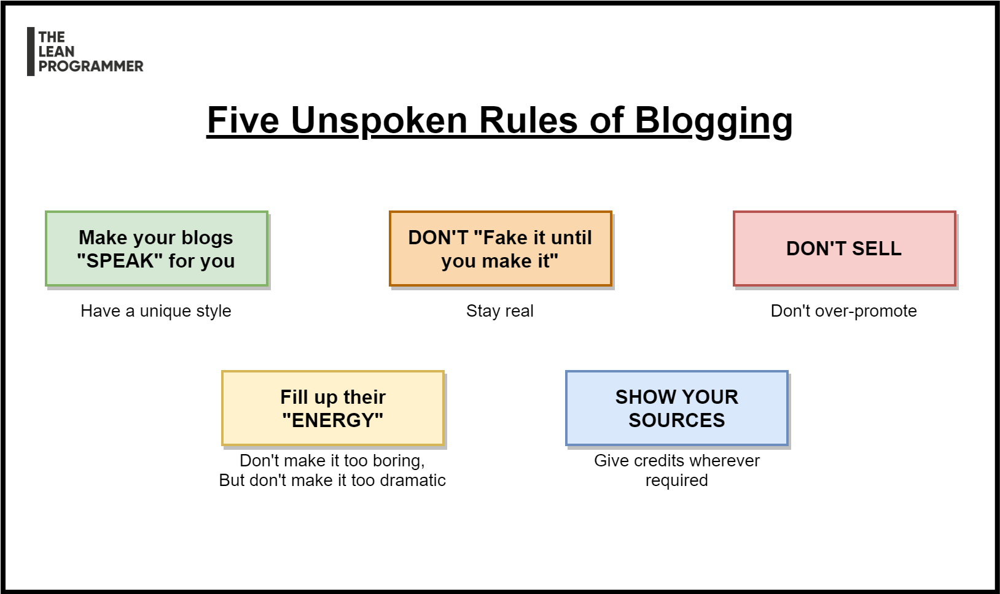

# 5 Unspoken Rules of Bogging

Five Unspoken Rules of Blogging

📌 Make your blogs speak for you

📌 Don't "Fake it until you make it"

📌 Fill up their energy

📌 Show your sources

📌 Don't sell

***

    

[See the full post here](https://www.linkedin.com/posts/madhavbahl_one-mistake-that-almost-all-of-us-make-activity-6747845691126673408-XZQM)