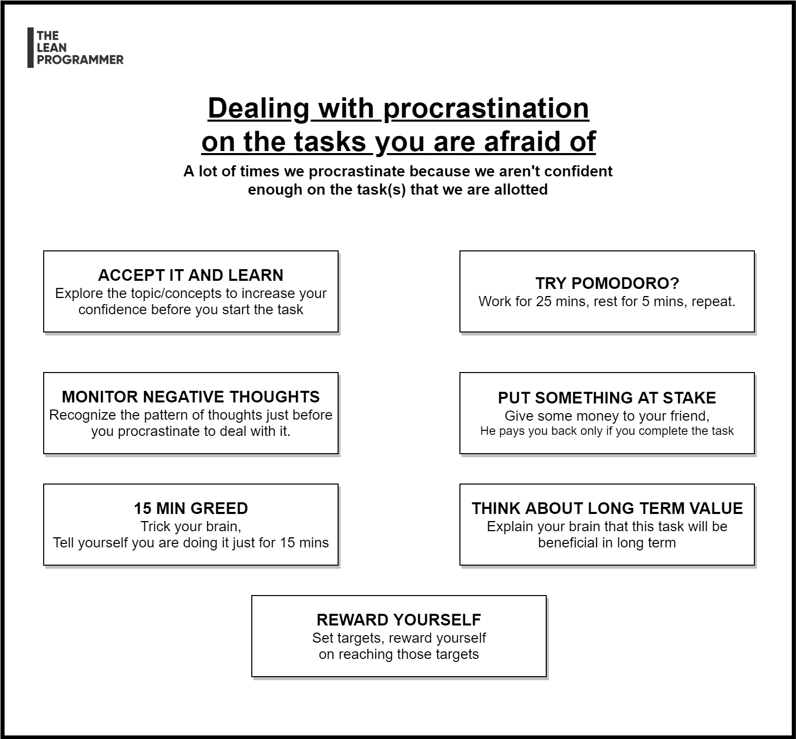

# Dealing with procrastination on the tasks you are afraid of

Often, the reason for procrastination is the fact that we dread the task, either we feel that we aren't skilled enough, or we aren't confident enough.

Here are 7 ways in which you can deal with this type of procrastination.

📌 Accept and Learn
👉 Acceptance is the first step towards improvement
👉 Ask yourself, are you skilled/confident enough?
👉 If the answer is no, reach out for help, study the topic a little before jumping on to the task

📌 Try Pomodoro
👉 Divided your tasks into chunks
👉 Work for 25 mins, rest for 5 mins
👉 Repeat 3 iterations and take a long break

📌 Monitor Negative Thoughts
👉 Recognize the pattern of thoughts that come just before you think of procrastinating
👉 Beware of those thoughts, don't let them increase

📌 Put something at stake
👉 We often procrastinate because we don't see any immediate gratification
👉 If that's the reason, give some money to your friend
👉 He returns that amount back to you only if you complete your task

📌 15 Minute Greed
👉 Often we overthink and the task appears more scarier than it actually is
👉 Force yourself into doing that task
👉 Tell yourself that do it for 15 mins, if it doesn't work out you will leave
👉 Chances are, that you will find it's not that scary

📌 Think about long term value
👉 Take a break
👉 Think about how beneficial this task is going to be in the long term
👉 Dream a little 😉

📌 Reward yourself
👉 Set targets
👉 Reward yourself if you achieve those goals

