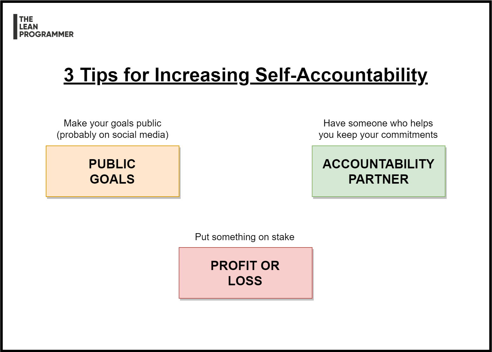

# 3 Tips for increasing self-accountability

Being accountable is an absolute requirement to build trust.

Here are 3 tips to increase your self-accountability

📌 Find an accountability partner
👉 Find someone whom you can tell your goals so that he can help you keep your commitments

📌 Make your goals public
👉 Call it the fear of embarrassment, or anything else, but by putting your goals on social media, or telling them to a few people, you can increase your motivation to complete the work.

📌 Profit/Loss
👉 Sometimes we procrastinate because of lack of sense of instant gratification (in other words, we feel that there's nothing on stake)
👉 Put something on stake
👉 Example: Give your friend some money, he returns it back to you only if you complete the task.

