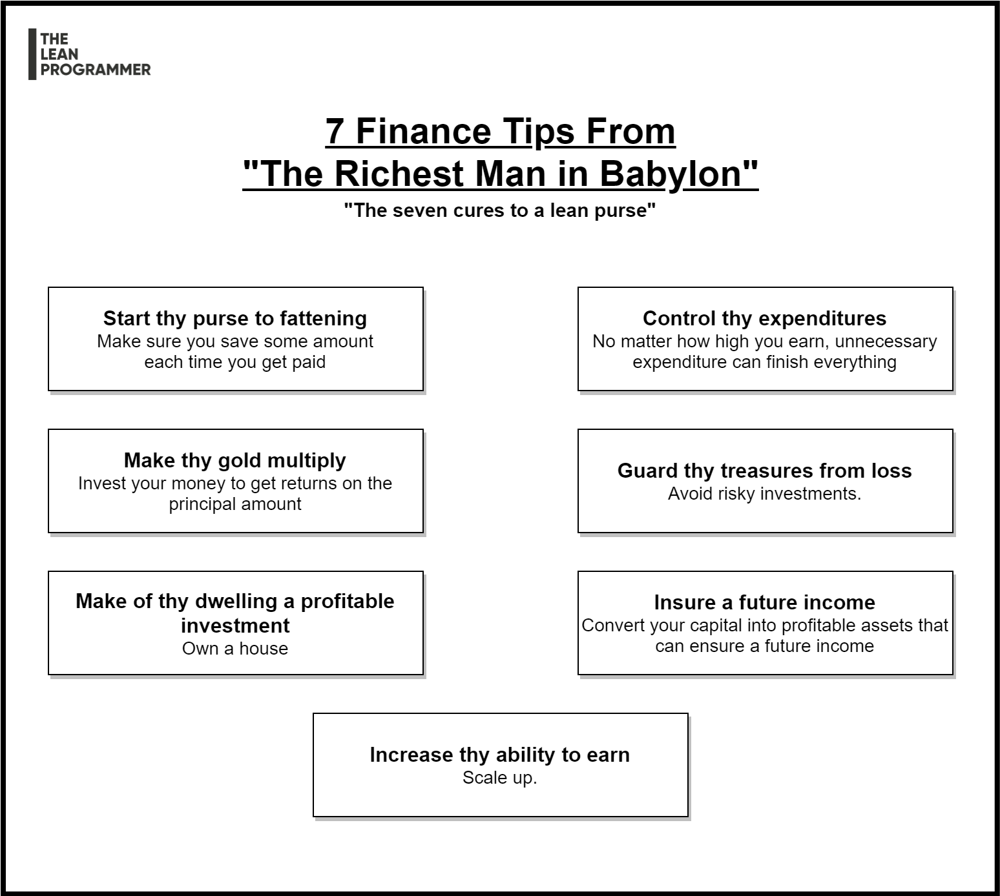

# Seven Finance Tips from "The Richest Man In Babylon"

Seven Finance Tips from "The Richest Man In Babylon"

📌 Save at least 10% of what you earn

👉 Every time you get paid, put at least 10% of it aside to let it accumulate

👉 First step towards growth is to save

📌 Reduce unnecessary expenditure

👉 No matter how high you earn, there's no limit to unnecessary expenditure

👉 Learn to differentiate between

- your needs

- your enjoyment

- your greed

It's fine to spend as much as you want on first, and also fine to spend on second, but there's no limit to 3rd.

📌 Invest

👉 Invest your savings to get returns on it

📌 Avoid risky investments

👉 Risky investments can make you lose all the saved money

👉 Invest your money at a place where the principal amount is safe

👉 Take calculated risks with proper guidance

📌 Own a house

👉 But, before that, learn and explore about the hidden expenses that comes with it

📌 Convert your capital into profitable assets

👉 Invest for future

👉 Have a retirement plan

📌 Increase your ability to earn

👉 Keep learning new skills throughout your life

