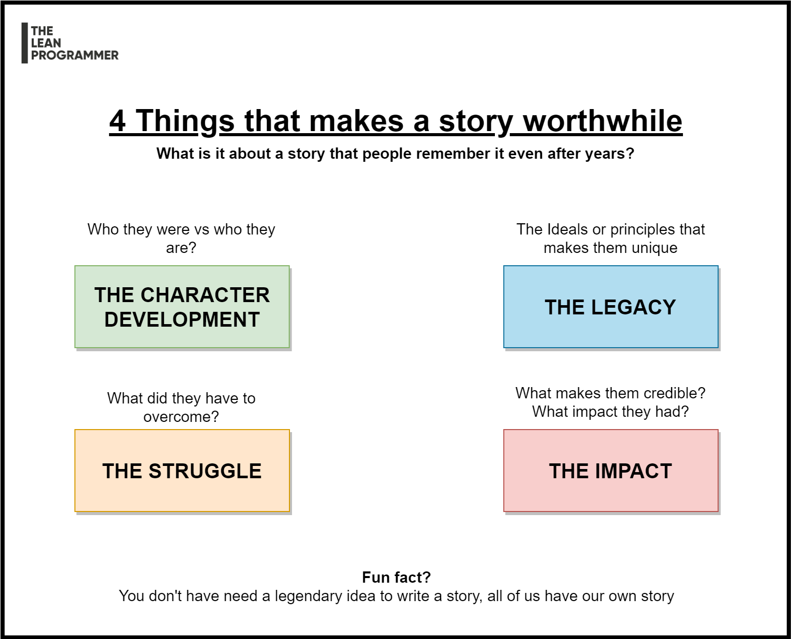

# 4 Things that make a story worthwhile

What is it about a story that people remember it even after years?

It's a fact that we (as human beings) are bad at remembering facts but very good at remembering stories,

And storytelling has always been an essential part of brand building.

All the big brands try to express themselves in a unique style, for example,

What comes to your mind when I say (for Indian readers)

📌 Washing Powder?

📌 Taste me best?

📌 Asli Masale Sach Sach?

📌 Melody itni chocolatey kyun hai?

📌 Daag achche hain?

There are hundreds of such examples. But for every such example, we can find two things in common

✅ 1. A brand impression that we have seen so many times that we never forget

✅ 2. A story that we can connect with

While the first part is relatively easier, whatever we see a lot of times, makes its place in our brain

What makes a brand so special is the fact that people can connect with the story it tells, and when it is relatable, it becomes something that people remember it even after years.

Here are 4 components that makes a story worthwhile 👇

***

    

