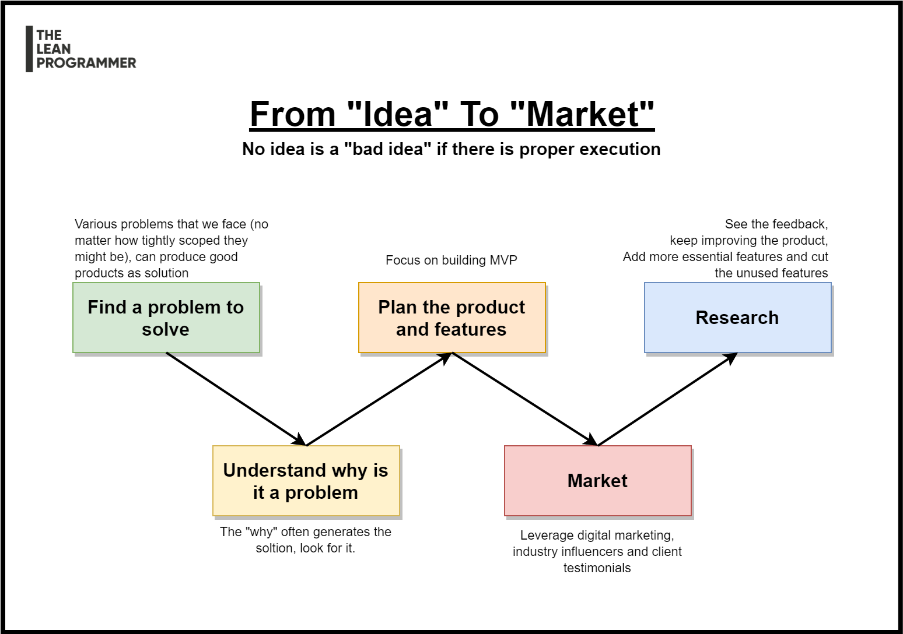

# 5 Steps from Planning to Product | Product Ideation

There will be some great ideas which will hit the user requirements at the right time, in the right way, and result in brilliant products,

But, spending way too much time finding a "brilliant" idea, might be a bad idea.

I follow this ideology - "Start small, Stay strong"

Think -> Create -> Market -> Improve

Here are the 5 steps from "planning" to "product"

📌 Find a problem to solve

📌 Understand why is it a problem, and list the possible solutions

📌 From the solutions, select the most feasible and plan the product

📌 Release and Market

📌 Research and develop

Let me know what do you think of the "Start small, stay strong" strategy? 👇

*** 

    

