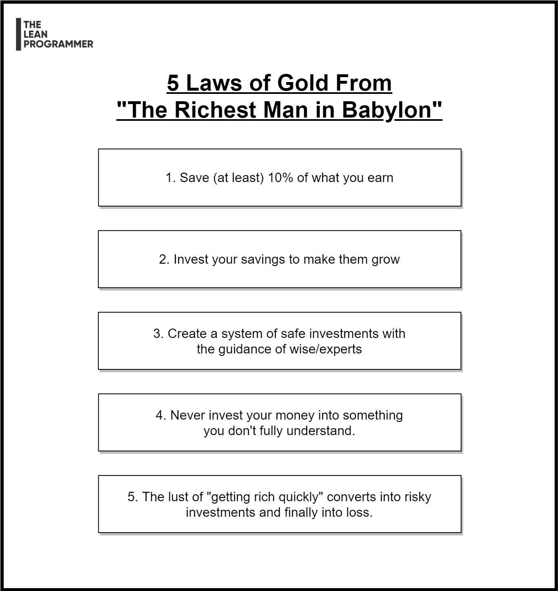

# 5 Laws of gold from "The Richest Man in Babylon"

5 Laws of gold from "The Richest Man in Babylon" ✨

Remember -

📌 Save (at least) 10% of what you earn
👉 Small savings gives huge results when compounded

📌 Invest your savings to make them grow
👉 There are a lot of options of investment, choose wisely

📌 Make safe investments with the guidance of experts
👉 There will be a lot of attractive schemes, don't go for them unless it's safe and trusted.
👉 Ask guidance from experts

📌 Don't invest in something you don't fully understand
👉 Attractive schemes with big returns that you don't understand fully often results in loss

📌 Don't invest with a greedy mindset
👉 The lust for quick money can make you lose your savings.

*** 

    

